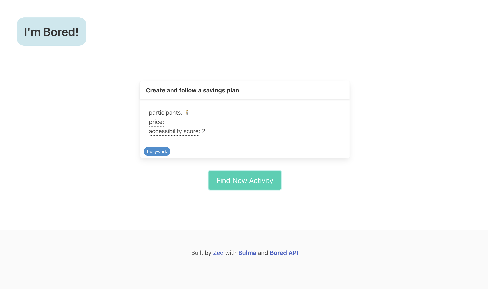

# I'm Bored!

This is a fun little app built on top of the [Bored API](https://www.boredapi.com/). 

The [Bulma](https://bulma.io/) CSS framework was used for component styling

User can click on the 'Find New Activity' button (see image below) to find things to do.

## Activity Scores

**participants**: The number of people that this activity could involve

**price**: The cost of the event with zero being free

**accessibility**: How possible an event is to do with zero being the most accessible

## Image
